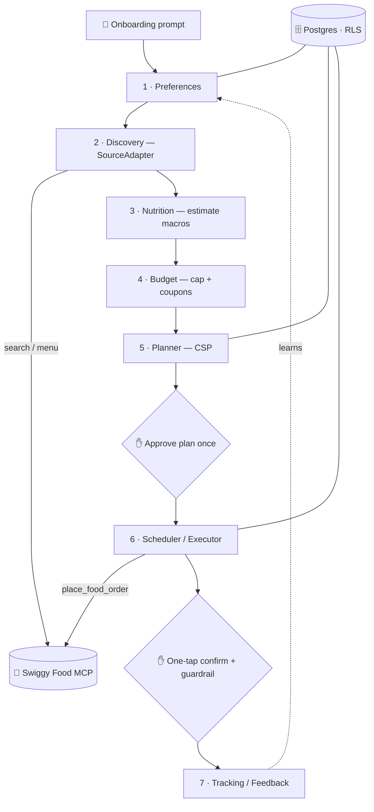

<!-- readme-gen:start:hero -->
<div align="center">


</div>
<!-- readme-gen:end:hero -->

<!-- readme-gen:start:badges -->
<div align="center">


<p>
  
</p>

</div>
<!-- readme-gen:end:badges -->

> Ordering food every day is a tax on your time, your budget, and your diet. **Rasa** answers a few questions once, then plans a whole month of meals to your macros and your spending cap — and orders each one for you through Swiggy, a single tap at a time. No 4 pm "what do I eat," no runaway bill, no diet that dies by Wednesday.

`Rasa` is the brand; `monthlymealprep` is the repo slug. This repository is the **v1 build**: a TypeScript pnpm monorepo — the agent runtime and state store are done; the mobile app and the remaining agents are in progress.

---

## ✨ Highlights

<table>
<tr>
<td width="50%" valign="top">

### 🗓️ A month, planned once

Answer a few preference questions and Rasa composes a 30-day plan — then you approve it a single time.

</td>
<td width="50%" valign="top">

### 🥗 Macro-aware, honestly

Every dish gets estimated calories + macros via a hybrid India-native pipeline. Framed as estimates, never medical claims.

</td>
</tr>
<tr>
<td width="50%" valign="top">

### 💸 Hard budget cap

A running spend ledger + coupon planning keeps the month under the number you set.

</td>
<td width="50%" valign="top">

### ✋ One tap, never silent

The plan is approved once; each order still needs a 5-second confirm. Allergens are a hard block.

</td>
</tr>
</table>

The defensible core (reserved for v2 behind a `SourceAdapter`): **neutral cross-platform orchestration** — one plan spanning Swiggy + Zomato + Instamart + tiffin, the seam the platforms structurally won't build.

---

## 🚀 Quick start

```bash
git clone https://github.com/Sheshiyer/rasa.git
cd rasa
pnpm install
pnpm test        # vitest — 149 tests (schemas, MCP, RLS store, nutrition, prefs, discovery, budget, guardrail, planner, executor)
pnpm typecheck   # tsc across workspaces
pnpm lint        # prettier --check
```

No external services are required to develop or test: the Swiggy MCP is mocked (`mock-swiggy-mcp`), and the state store runs on an in-process Postgres (`pglite`) that executes the real migration with RLS enforced.

<!-- readme-gen:start:packages -->

## 📦 Packages

| Package        | Path                 | What it is                                                                          | Status   |
| -------------- | -------------------- | ----------------------------------------------------------------------------------- | -------- |
| `@rasa/shared` | [`shared/`](shared/) | Zod schemas (6 domain entities), the `SourceAdapter` moat boundary, guardrail types | ✅       |
| `@rasa/server` | [`server/`](server/) | Swiggy MCP client + adapter, RLS state store, the nutrition pipeline, agents        | 🚧 M0–M7 |
| `@rasa/app`    | `app/`               | Expo (React Native) client — onboarding, plan review, one-tap confirm               | ⬜ M9    |

<!-- readme-gen:end:packages -->

<!-- readme-gen:start:architecture -->

## 🏗️ Runtime architecture

Seven composable agents + a guardrail gate + a Postgres state store. Discovery and the executor reach food sources only through the `SourceAdapter` boundary.



<!-- readme-gen:end:architecture -->

<!-- readme-gen:start:tree -->

## 🗂️ Project structure

```
📦 rasa  (repo slug: monthlymealprep)
├── 📂 shared/              # @rasa/shared — Zod schemas + SourceAdapter (moat) + guardrail types
├── 📂 server/
│   └── 📂 src/
│       ├── 📂 mcp/         # Swiggy MCP client, 14 typed tool wrappers, OAuth2.1/PKCE, mock
│       ├── 📂 adapters/    # SwiggyAdapter (implements SourceAdapter)
│       ├── 📂 store/       # RasaDb (pglite/pg) + repositories + RLS
│       ├── 📂 agents/      # nutrition pipeline (M3); prefs/budget/planner/scheduler (M4–M8)
│       └── 📂 llm/         # LlmClient interface (Anthropic impl at LLM-integration)
├── 📂 db/migrations/       # 0001_init.sql — schema + RLS policies
├── 📂 data/indb/           # INDB nutrition seed (per-100g macros)
├── 📂 docs/                # design spec, implementation plan, architecture diagram, genesis
└── 📂 .brandmint/          # Rasa brand DNA + generated assets
```

<!-- readme-gen:end:tree -->

## 🧭 Milestones

| ✅ Done                                             | ⬜ Upcoming                  |
| --------------------------------------------------- | ---------------------------- |
| **M0** — monorepo scaffold + `@rasa/shared` schemas | **M8** — Tracking / Feedback |
| **M1** — `SourceAdapter` + Swiggy MCP client + mock | **M9** — Expo app            |
| **M2** — state store + repositories + RLS           | **M10** — dry-run acceptance |
| **M3** — nutrition pipeline                         | —                            |
| **M4** — Preferences Agent + onboarding prompt      | —                            |
| **M5** — Discovery + Budget agents                  | —                            |
| **M6** — Guardrail + Planner (CSP)                  | —                            |
| **M7** — Scheduler / Executor                       | —                            |

- **Design spec:** [`docs/superpowers/specs/2026-07-05-monthlymealprep-design.md`](docs/superpowers/specs/2026-07-05-monthlymealprep-design.md)
- **Implementation plan (10 milestones):** [`docs/superpowers/plans/2026-07-05-monthlymealprep-v1-implementation-plan.md`](docs/superpowers/plans/2026-07-05-monthlymealprep-v1-implementation-plan.md)
- **Architecture diagram:** [`docs/architecture/runtime-agent-pipeline.html`](docs/architecture/runtime-agent-pipeline.html)
- **Brand:** [`.brandmint/BRAND-BRIEF.md`](.brandmint/BRAND-BRIEF.md)

<!-- readme-gen:start:health -->

## 🩺 Project health

| Category                 | Status               | Score |
| :----------------------- | :------------------- | ----: |
| Tests (149, Vitest)      | ████████████████████ |  100% |
| Type safety (TS strict)  | ████████████████████ |  100% |
| Lint / format (Prettier) | ████████████████████ |  100% |
| Documentation            | ██████████████████░░ |   90% |
| CI/CD                    | ░░░░░░░░░░░░░░░░░░░░ |    0% |

> **Overall: strong** — the code is fully typed and tested; CI wiring is a to-do.

<!-- readme-gen:end:health -->

## 🛠️ Tech

TypeScript (strict) · pnpm workspaces · [Zod](https://zod.dev) · [`@modelcontextprotocol/sdk`](https://modelcontextprotocol.io) · Postgres via [`pglite`](https://pglite.dev) (test/dev) + [`node-postgres`](https://node-postgres.com) (prod, Supabase) · [Vitest](https://vitest.dev) · Prettier. Mobile: Expo / React Native (M9).

## 📄 License

**Proprietary — © 2026 Sheshnarayan Iyer / Thoughtseed. All rights reserved.** See [`LICENSE`](LICENSE). This source is published for visibility; it is not licensed for use, modification, or redistribution.

<!-- readme-gen:start:footer -->
<div align="center">


_Taste, balanced._

</div>
<!-- readme-gen:end:footer -->
